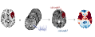
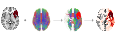

# What is lesion network mapping?

Lacuna characterizes a lesion by contextualizing it against several kinds of normative
reference data. *Lesion network mapping* is one family of methods within that broader
characterization. This page explains the idea.

A brain lesion's consequences depend not only on the
tissue it destroys, but on the wider network that tissue belonged to. Two lesions
of similar size in different locations can produce *similar* symptoms — because they
map to the same network. **Lesion network mapping** is the family of methods that
makes this network context explicit.

The core idea is to take an individual lesion mask and look it up in *normative*
brain data — connectivity measured in large samples of healthy people — to infer
which circuits the lesion engages. Because the connectivity comes from a normative
reference rather than the patient, the method works even when you only have a
lesion mask derived from anatomical images and no functional or diffusion imaging of the patient.

## The types of lesion network mapping implemented in Lacuna

### Functional lesion network mapping (FNM)

**Which functional circuit is connected to the lesion site?** Lacuna takes the
lesion mask as a seed and computes its resting-state functional connectivity to
the rest of the brain, using a normative functional connectome (e.g. GSP1000).
The result is a whole-brain map of the functional network linked to the lesion.
This functional variant is what the unqualified term *lesion network mapping* most
often refers to in the literature.

<figure markdown="span">
  { width="760" }
  <figcaption>Functional network mapping procedure shown with exemplary lesion.</figcaption>
</figure>

For further reading, see [Fox et al., 2018](https://doi.org/10.1056/NEJMra1706158), [Boes et al., 2015](https://doi.org/10.1093/brain/awv228), and [Siddiqi et al. 2021](https://doi.org/10.1038/s41562-021-01161-1).

### Structural lesion network mapping (SNM)

**Which white-matter connections does the lesion disconnect?** Instead of
functional correlation, SNM uses a normative tractogram (e.g. HCP1065 or dTOR985)
to find the streamlines that pass through the lesion, yielding a map of structural
disconnection. SNM additionally requires [MRtrix3](https://www.mrtrix.org/). This
structural variant is also known as *disconnectome mapping* or *disconnectivity
mapping*.

<figure markdown="span">
  { width="760" }
  <figcaption>Structural network mapping procedure shown with exemplary lesion.</figcaption>
</figure>

For further reading, see [Thiebaut de Schotten et al., 2020](https://doi.org/10.1038/s41467-020-18920-9), [Salvalaggio et al., 2020](https://doi.org/10.1093/brain/awaa156) and [Talozzi et al., 2023](https://doi.org/10.1093/brain/awad013).

### Accelerated functional network mapping (AFNM)

This answers the **same question as FNM** but with a faster, matrix-based
implementation built on a parcellated functional connectome. It trades the
full voxel-resolution map for substantially lower compute and memory cost.

Use it when you are processing many subjects and a parcel-resolution functional
map is sufficient; use the standard FNM when you need voxel-level detail.

For further reading, see [van den Heuvel et al., 2026](https://doi.org/10.1038/s41593-025-02196-7).