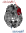

---
hide:
  - navigation
---

<div style="display: flex; align-items: center; gap: 2rem;" markdown>
<div markdown>

# Lacuna

When a stroke, tumor, or other focal injury damages brain tissue, understanding its consequences requires placing the lesion in the broader context of brain organization.

Lacuna is an open-source toolbox designed to facilitate this process. Using normative reference data from healthy individuals, including functional and structural connectivity datasets and anatomical atlases, it generates a range of measures that characterize a lesion beyond its anatomical location alone.

Lacuna is built to be easy to adopt: you provide lesion masks in MNI space, and it takes care of the rest — fetching the normative reference data, aligning coordinate spaces, and writing BIDS-organized outputs through a command line interface. Developed for multicenter research, it standardizes inputs and outputs, scales from a single mask to entire cohorts with batch processing, supports deployment on high-performance computing (HPC) systems through containerized environments and records traceable provenance for every result, all within a modular architecture designed to grow toward further lesion-characterization methods.

</div>

</div>

!!! warning "This project is under active development and has not yet been fully validated. Use with caution."

## Capabilities

<div class="grid cards" markdown>

-   **Functional lesion network mapping**

    ---

    { width="180" style="display: block; margin: 0.5em auto;" }

    Map the functional brain circuitry linked to a lesion using resting-state functional connectivity.

-   **Structural lesion network mapping**

    ---

    { width="220" style="display: block; margin: 0.5em auto;" }

    Map the structural disconnectivity of a lesion using normative tractogram data.

-   **Focal damage**

    ---

    { width="180" style="display: block; margin: 0.5em auto;" }

    Quantify focal damage by measuring lesion overlap with standard brain parcellation atlases.

</div>

## Install

```bash
pip install git+https://github.com/m-petersen/lacuna
```

## Usage

```bash
# Create a tutorial dataset with synthetic lesion masks
lacuna tutorial my_dataset

# Fetch the HCP1065 tractogram
lacuna fetch hcp1065 --output-dir connectomes

# Run structural network mapping
lacuna run snm my_dataset output \
    --connectome-path connectomes/hcp1065.tck \
    --mask-space MNI152NLin6Asym
```

For the full walkthrough, see the [Getting started](tutorials/getting-started.ipynb) tutorial. Note that Lacuna expects lesion masks to be in MNI space.

## Documentation

<div class="grid cards" markdown>

-   [**Tutorials**](tutorials/index.md)

    ---

    Step-by-step Jupyter notebook tutorials covering each analysis type.

-   [**How-to guides**](how-to/index.md)

    ---

    Practical guides for specific tasks beyond core analysis workflows.

-   [**Reference**](reference/index.md)

    ---

    CLI commands, options, and auto-generated API documentation.

-   [**Explanation**](explanation/index.md)

    ---

    Background knowledge for using the package.

</div>

## Issues

Please report issues on [GitHub](https://github.com/m-petersen/lacuna/issues).

<div style="display: flex; align-items: center; gap: 2rem;" markdown>
<div markdown>

## Meta VCI Map Consortium

This toolbox is developed as part of ongoing efforts within the [Meta VCI Map Consortium](https://metavcimap.org/), an international collaborative platform dedicated to advancing multicenter lesion analysis in vascular cognitive impairment. The consortium brings together large-scale datasets and interdisciplinary expertise to improve reproducibility and generalizability in lesion–symptom mapping and related approaches. This toolbox reflects these principles by providing standardized, scalable tools for the analysis of lesion–behavior relationships across diverse cohorts.

</div>

</div>

## Funding

<div style="display: flex; justify-content: space-around; align-items: center; gap: 10px;">


</div>